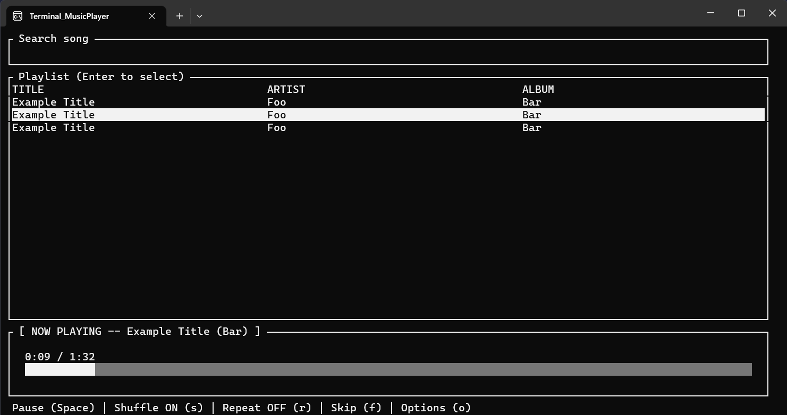
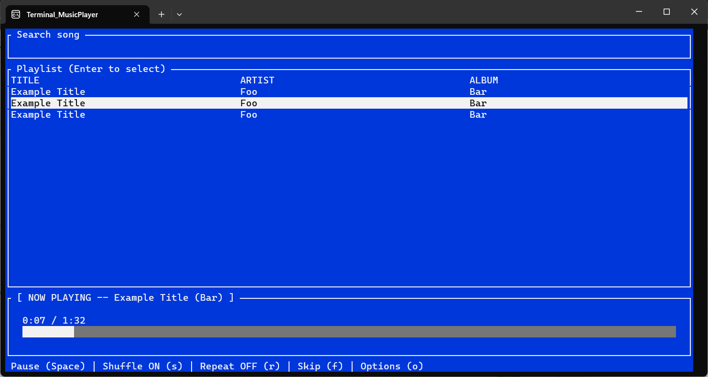
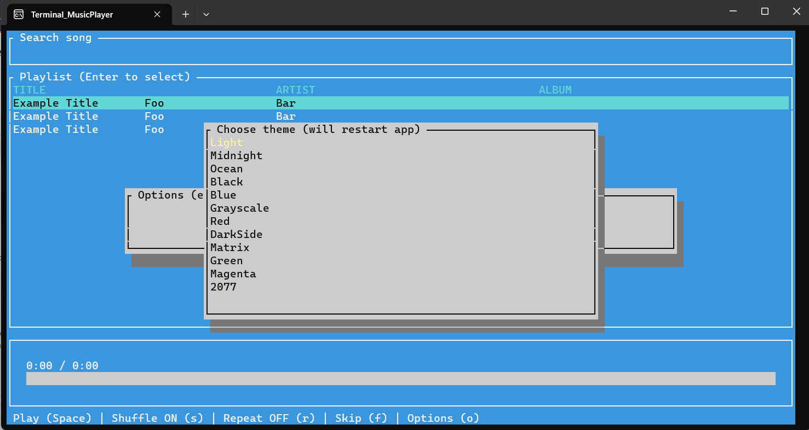
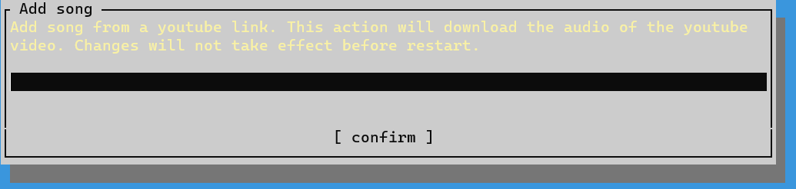

# Terminal Music Player

This was done as a hobby project.

It is a terminal-based music player that includes a full graphical UI and all the basic functionality you would expect from a music player (such as shuffle, repeat etc). In addition, there is functionality to download audio from a youtube video.

supports both mouse and keyboard, courtesy of Terminal.Gui

* The GUI is made with Terminal.Gui (https://github.com/gui-cs/Terminal.Gui).
* The audio playback is handled by NAudio (https://github.com/naudio/NAudio).

## Screenshots

## Some notes

Playlists are handled as folders, with the default folder being ./DefaultSongFolder. If you want to have multiple playlists, you need to create new folders with the songs in them (location doesn't matter) and navigate to them through the UI. Empty playlists are not allowed and will stop the application. If your solution folder is not on your C:\ drive, the program will not run.

## Youtube audio download UI
If you want to use the youtube audio download feature, you need yt-dlp (https://github.com/yt-dlp/yt-dlp).

It is recommended to use this in combination with something that would allow you to 1) add tags and 2) normalize volume across files. I personally use wxmp3gain (https://github.com/cfgnunes/wxmp3gain) and mp3tag (https://www.mp3tag.de/en/)

The command used in the download is: 
> yt-dlp --audio-format mp3 -x --audio-quality 0 [link]

You _could_ change this command in DAL/OptionsRepo AddSong method, but keep in mind that not all audio file types are supported by NAudio.  

## Known issues:
* alt-tabbing breaks switching between views with tab. Can be fixed by pressing shift once.
